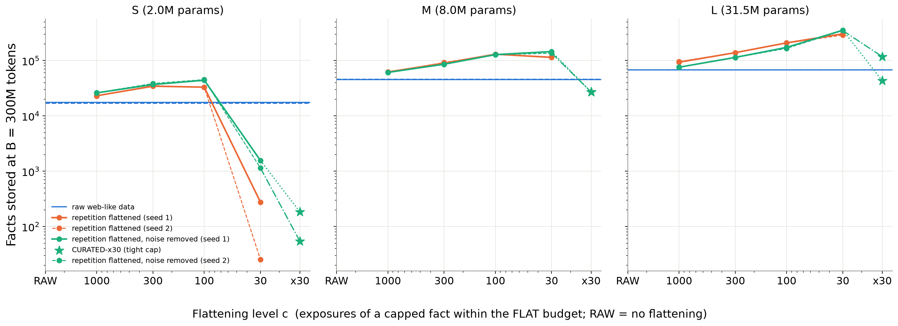

# Bits, not tokens

**Models learn information, not data.** What a small language model stores from a corpus is
set by how its training tokens are spent — by each fact's exposure rate — not by how many
tokens there are; and counting the distinct facts a corpus delivers turned out to be the
wrong axis too (the archived rounds). In a synthetic world of 1,000,000 random 12-bit facts,
flattening a web-like (Zipf) repetition profile lets the same model store 2–5× more facts
from the same 300M-token budget, with no loss on the raw distribution. Removing the noise
tokens as well bought little: about 15 % more facts at L (349K vs 303K) and nothing at S or M.
A stationary stream reaches its steady state within ~10⁷ documents and does not grow with
2× or 4× longer training. The advantage holds under five optimizer recipes, and forgetting is
finite even without weight decay, scaling with the learning rate.

This repository backs Part 1 of the Pokee Insights series: <POST URL>.



## Headline numbers

Facts stored at B = 300M training tokens (top-1 on delivered facts, chance-corrected), base
recipe, at the flattening level pre-selected for each size. Means over 5 seeds (RAW, FLAT) or
3 seeds (CURATED); ratios with 95 % t-intervals over the confirmation seeds (`RESULTS_V5.md`, R4).

| model (non-embedding params) | RAW (web-like) | FLAT (repetition flattened) | ratio FLAT / RAW | CURATED (flattened, noise removed) | ratio CURATED / RAW | raw-distribution accuracy RAW → FLAT |
|---|---|---|---|---|---|---|
| S (2.0M) | 17,598 | 35,246 (level 300) | **1.98** [1.82, 2.15] | 38,605 | 2.18 [1.89, 2.47] | 0.770 → 0.841 |
| M (8.0M) | 45,399 | 129,201 (level 100) | **2.84** [2.79, 2.89] | 128,082 | 2.82 [2.73, 2.91] | 0.861 → 0.935 |
| L (31.5M) | 68,033 | 303,232 (level 30) | **4.47** [4.39, 4.54] | 349,328 | 5.10 [5.06, 5.15] | 0.890 → 0.912 |

Against the pre-registered bars: the 3× curated-vs-raw bar (P1) is met by L only; a 2M model on
curated data does not match a 31M model on raw data (P2), though an 8M model does; the head-loss
guard (P3) passes at every selected level. Details and verdicts in `RESULTS_V4.md`; robustness,
steady state, retention half-lives and intervals in `RESULTS_V5.md`.

## The experiment

Two pre-registered rounds. **v4** (`briefs/v4.md`, `PASS_CRITERIA_v4.md`, `RESULTS_V4.md`):
three corpus types — RAW (i.i.d. from a shifted Zipf over all facts, 16 noise tokens per
document), FLAT-c (the same distribution with probabilities capped at a level c, so a capped
fact gets c expected exposures) and CURATED-c (FLAT-c without noise tokens) — at four levels,
three model sizes, two seeds, plus predictions committed before launch. The FLAT runs landed
within 12 % of prediction at every level where the head was kept; CURATED came in at about
half, which is the rate-not-count finding (`RESULTS_V4.md`, "Predicted versus actual"). **v5** (`briefs/v5.md`,
`CRITERIA_v5.md`, `RESULTS_V5.md`): the same comparison under five optimizer recipes, at 2× and
4× the budget, with a retention probe measuring forgetting directly, and three more seeds.

Model: GPT-2-style decoder (S 6×168, M 8×288, L 10×512; `configs/models.yaml`), one document
per row, AdamW, single pass. World seed 0 throughout; every run is determined by (corpus
config, seed) and was reproduced bit-exact on rerun. Object losses are in bits over the
4,096-object softmax (`DEVIATIONS.md` #1). `DEVIATIONS.md` lists every departure from the
briefs, including two operational restarts of the v4 queue.

## Quickstart

```bash
uv venv --python 3.12 .venv && uv pip install --python .venv/bin/python -r requirements.txt
.venv/bin/python -m pytest -q                        # CPU tests (< 1 min); -m slow adds the GPU learnability test
.venv/bin/python analysis/make_figures_v4.py         # v4 figures + results/v4_summary.json from CSVs, no GPU
.venv/bin/python analysis/make_figures_v5.py         # v5 figures + results/v5_summary.json, no GPU
scripts/run_all.sh                                   # rerun the whole matrix on idle GPUs (~7 h on 8 H100s)
```

A single run: `train/train.py --corpus configs/v3/FLAT.yaml --model M --seed 1 --v5 --budget-tokens
300000000 --tau <tau> --warmup-docs 300000 --level 100 --corpus-type FLAT --setting base`; the
exact flags for every run are in `scripts/ops/queue_*.txt`, and τ per level in `results/v4_levels.csv`.

## Layout

```
briefs/                 the v4 and v5 briefs as given
PASS_CRITERIA_v4.md     pre-registered v4 criteria; CRITERIA_v5.md — v5 criteria; C_STAR.md — frozen warm-up lengths
RESULTS_V4.md, RESULTS_V5.md, DEVIATIONS.md
configs/                models.yaml, frozen learning rates (v3_lr.yaml), corpora (configs/v3/: RAW, FLAT, CURATEDF), probe (v5.yaml)
synth/                  world (facts, templates, vocabulary), document streams, closed forms, τ solver
train/                  model and trainer (token budgets, cooldown branches, schedules, probe)
eval/                   evaluators (object loss, facts stored, raw-distribution accuracy, head loss, control, probe)
analysis/               v4_analysis / v4_predict / v5_analysis and the two figure scripts
results/                v4_runs/, v5_runs/ (one CSV per run), baseline_raw/ (RAW baselines), merged tables, predictions, summaries
figures/                all figures (png + pdf)
tests/                  world and document format, learnability (GPU), flat stream and τ, eval set, retention probe
scripts/                run_all.sh; scripts/ops/ holds the launcher, queue runner and the exact job lists
artifacts/, logs/       not in git: per-run n_k, per-fact hits, exposure times, probe logs, run logs
```

Some frozen files (`RESULTS_V4.md`, `RESULTS_V5.md`, `PASS_CRITERIA_v4.md`, `C_STAR.md`,
`configs/v3/`) refer to "v3": that is the earlier design round in which the RAW baselines and
warm-up constants were produced. The three earlier rounds are preserved byte-for-byte on
branch `archive/rounds-1-3`. They taught three things, in this order: (a) a fact needs many
exposures before it is stored; (b) a corpus with no heavily repeated facts never forms the
recall mechanism at all (Zucchet et al. 2025, arXiv 2503.21676); (c) a stream that shows
each fact its quota and then drops it forgets everything dropped.

## Cite

```bibtex
@misc{zhu2026bitsnottokens,
  title        = {Bits, not tokens: what a small language model stores is set by exposure rate},
  author       = {Zhu, Zheqing},
  year         = {2026},
  publisher    = {Pokee AI},
  howpublished = {\url{https://github.com/Pokee-AI/bits-not-tokens}}
}
```

`CITATION.cff` carries the same metadata. Zenodo DOI: <DOI pending>.

This world contains only arbitrary random facts: nothing here is about generalisation,
reasoning or compressible structure. License: Apache 2.0.
